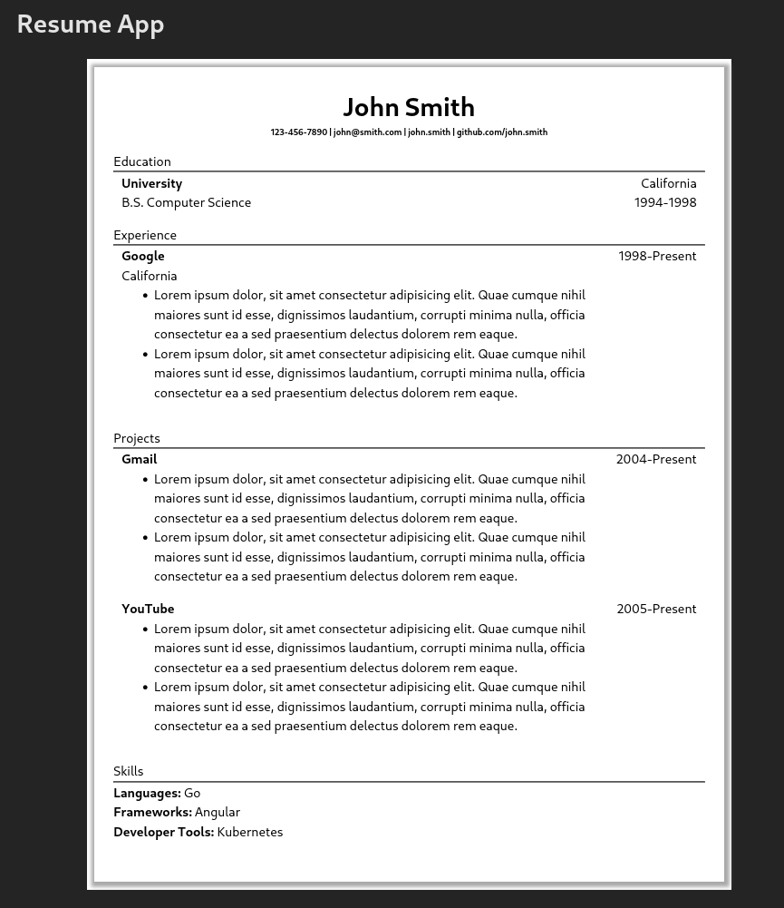

# Resume Creator

An app for editing and creating a resume developed using ReactJS.

## Runtime Dependencies
npm

## Installation

Clone the repository locally. Install dependencies using the proper npm command then build or run it using the command.

```bash
git clone https://github.com/jibrilfdev/react-resume-creator
cd react-resume-creator
npm install
npm run dev
```

## Usage

Edit the various sections and see changes to the result of your resume as they happen.



## Contributing

Pull requests are welcome. Issues are welcome, and will potentially be addressed.

## License

[MIT](https://choosealicense.com/licenses/mit/)
